# Impression

## My journey — work by Markéta Rašínová

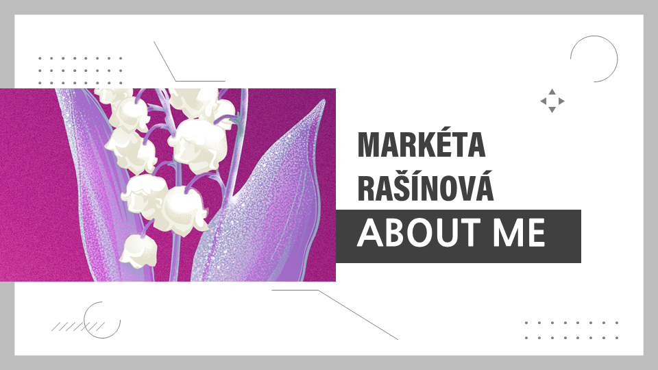

My name is Markéta Rašínová and I am a graphic designer with passion for package design and brand identity. This presentation is about me and my journey of following my dream.

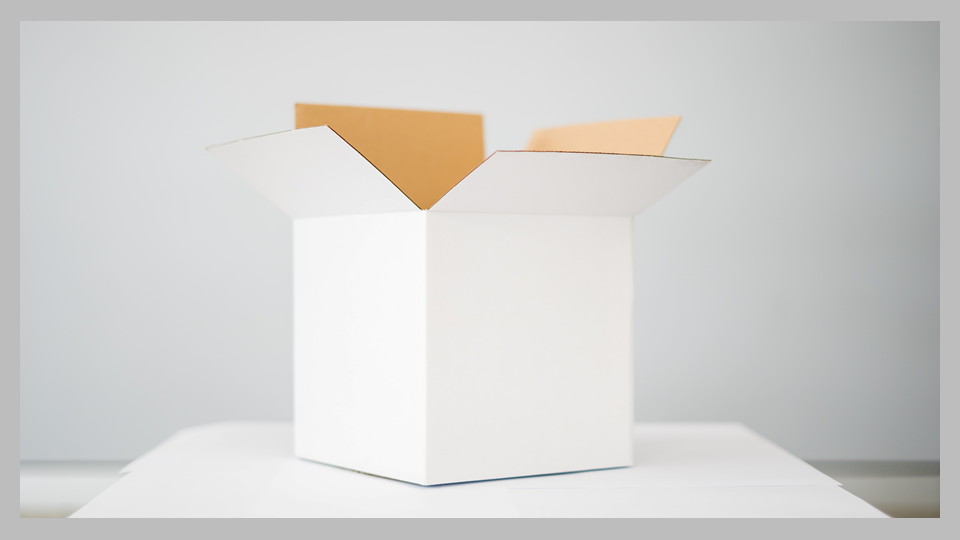

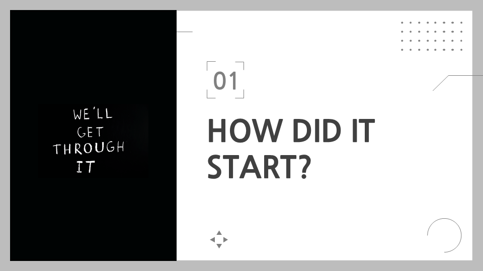

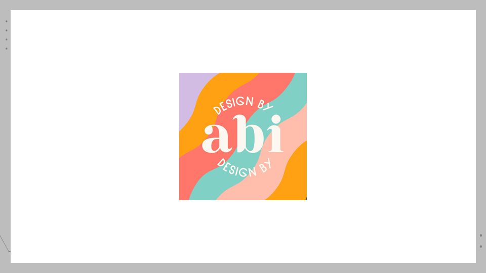

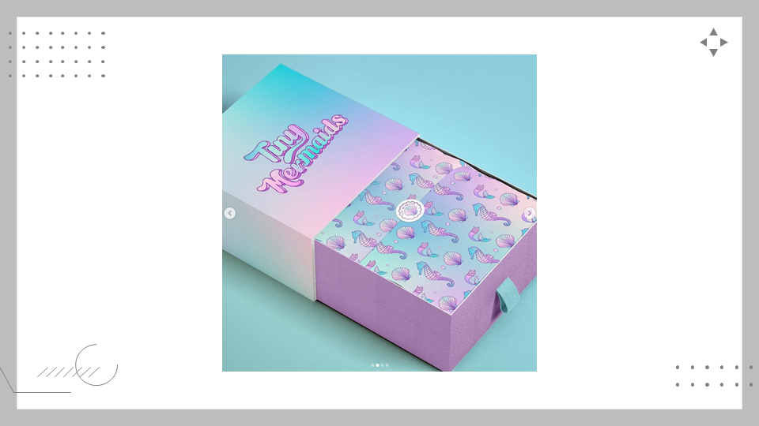

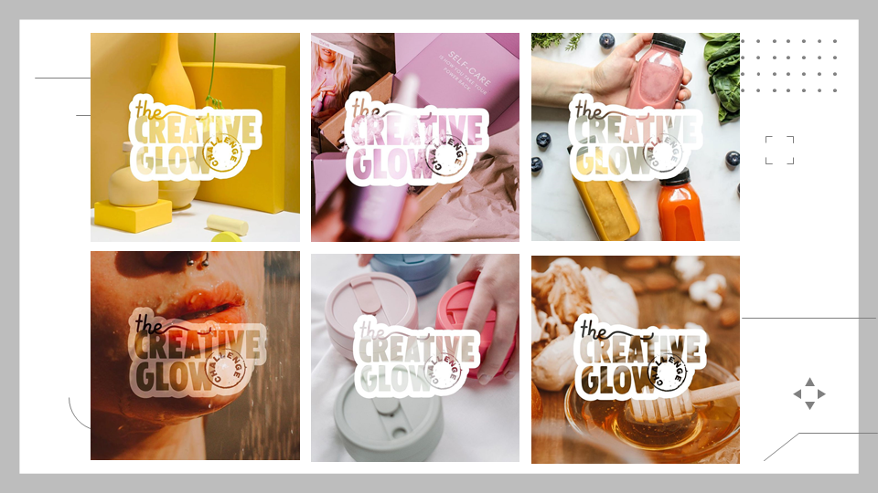

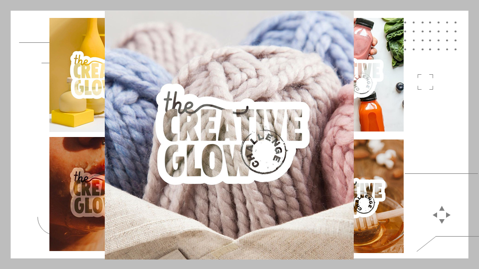

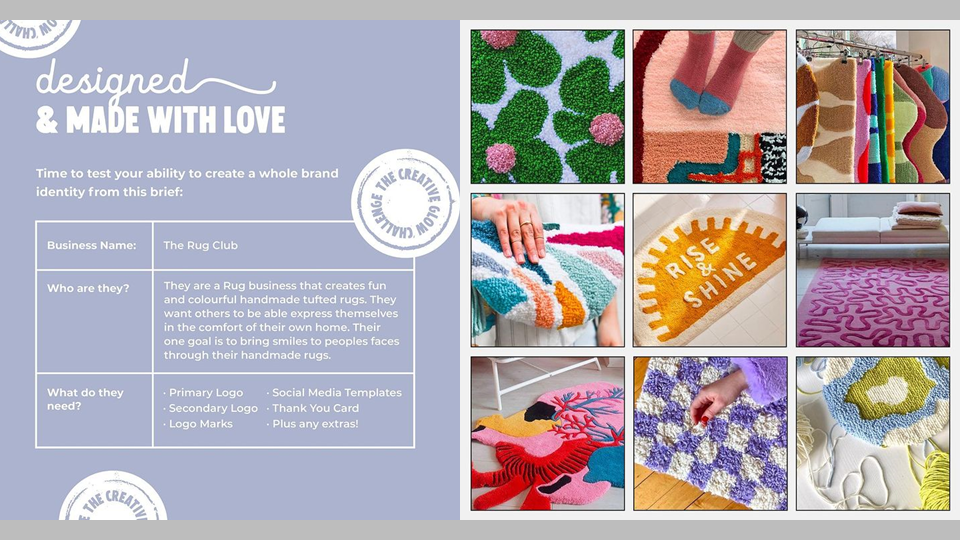

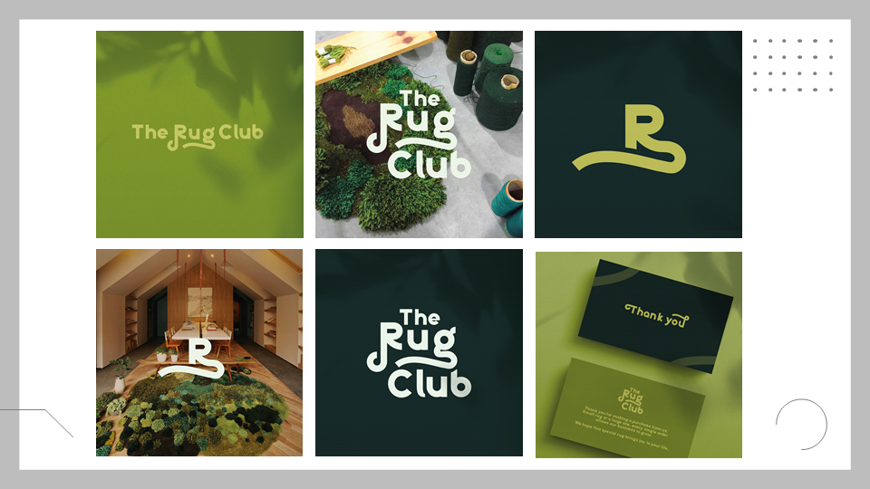

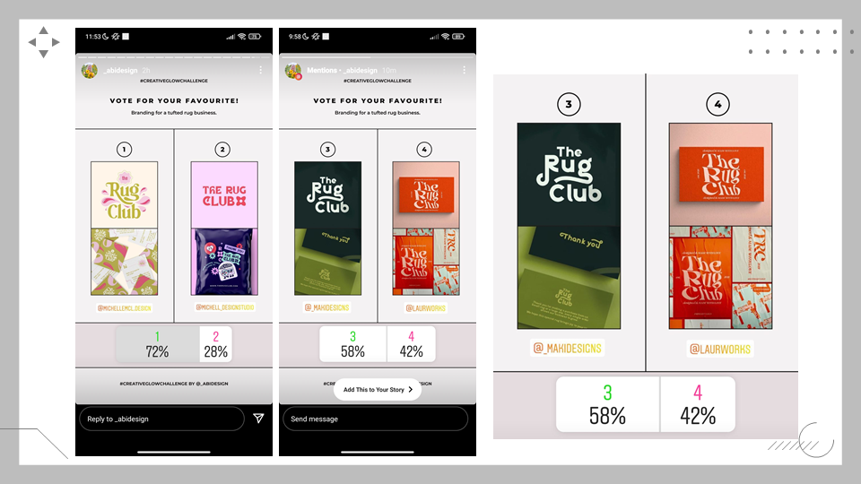

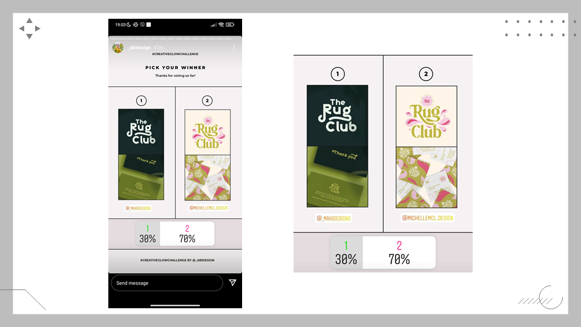

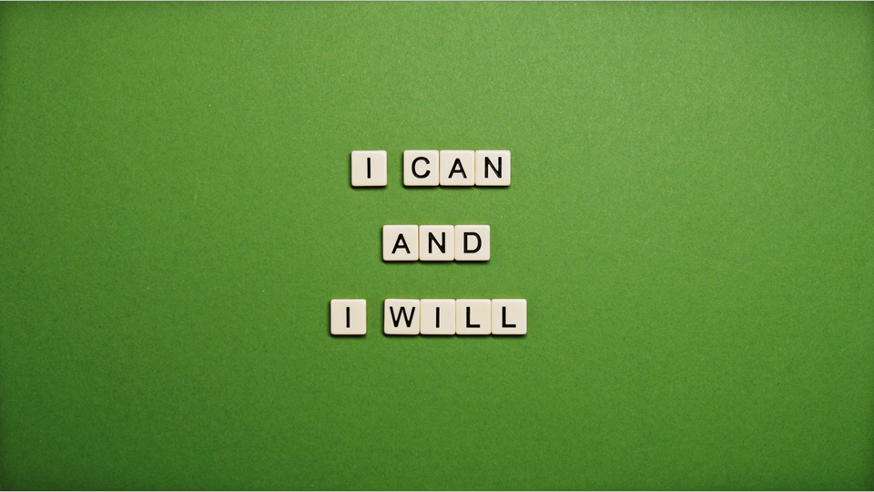

### Notes

Numbered comments correspond to slide order.

1. Talk about my passion
2. How I feel when I look at a white can/box
3. Wasn't always sure about my work. How did I find myself?
4. Youtube and instagram account of AbiDesign
5. How much I learned from her tips and videos and how she inspired me
6. How I followed her tips and made these designs
7. Talk about how much I improved
8. Creative glow challenge and how it works
9. The challenge I participated in
10. Bried of the challenge
11. My entry
12. How I was became a top 4 pick of my favourite creator
13. And how far I made it
14. Keep on following your dreams

