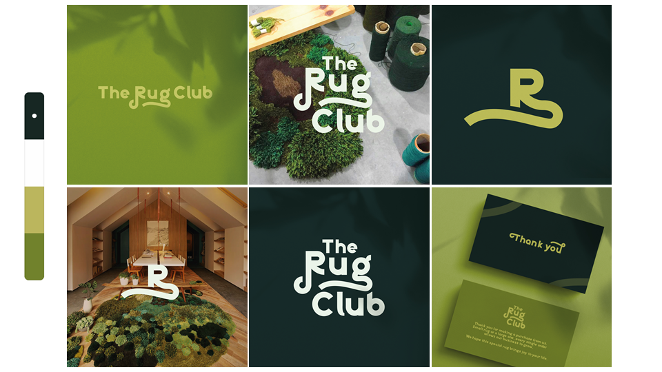
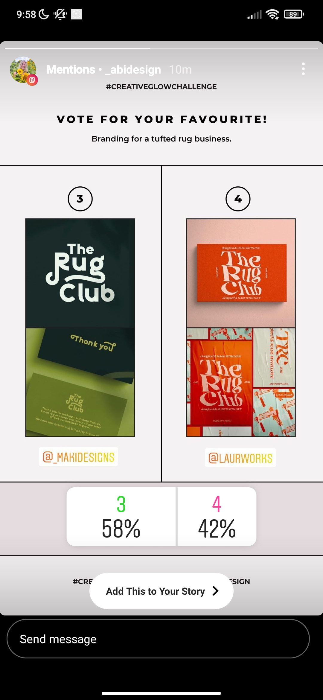

# The Rug Club 🌿

What was this project exactly?

It was one of many Creative Glow Challenges hosted by Abi Design on instagram.

Working on this project and succeeding made me believe in myself and see my self worth. Even though I had been studying and working part time on top of it, I managed to make time for passion projects such as this one. Participants had one week to create a whole brand identity from scratch and present a unique logo, social media posts and a thank you card.

## Brief

**Business name:** The Rug Club

**Who are they?** They are a Rug business that creates fun and colourful handmade tufted rugs. They want others to be able to express themselves in the comfort of their own home. Their one goal is to bring smiles to peoples faces through their handmade rugs.

**What they need?**

- Primary logo
- Secondary logo
- Logo mark
- Social media templates
- Thank You card

## The problem

Finding the perfect rug looking font was relatively easy. The hard part was making it original and playing around with the layout. It took hours of moving around different letters and playing around with the iconic swoosh to make it all fit perfectly together.

## Action

The main thing that helped me finish this project was believing in myself, having fun and trying out different things that I wouldn't have thought of otherwise. Not being worried about what will others think and whether I'll succeed or not made it really enjoyable and fun experience for me.

## Success

Having fun and letting your creativity flow was definitely the best decision I've made. This lead to me being the top 4 picks of the host, which is my big role model when it comes to designing. I feel like you could just sense the love I've put into it just by looking at my designs. Which makes it even more special to me.

