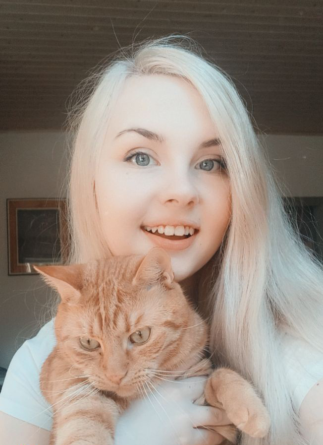

# Markéta Rašínová

## About Me

I'm a graphic designer with passion for package design, stubborn enough to achieve almost anything.

- [My Case Study](case-study.md) <!-- A link to your case study -->

## My Story

Alt text: A crazy cat lady holding a fluffy hostage that's already planning an escape.

Ever since I was a little kid, colours made me incredibly happy. So happy, I wanted to surround myself with them. And this love for colours just grew bigger the older I got. 

As any other kid, I loved to draw. But with my generation having access to the World Wide Web, got to try many different creative things. I learned how to edit videos, animate and how to code a whole website. I got so sucked into this digital world, I wanted nothing more.

So I became a graphic designer and the more I created, the more I learned and loved every step of the way. Designing packages and brands makes my world a whole lot more colourful.
