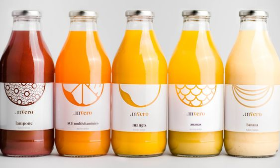

- [Summary](#summary)
- [Mind Map](#mind-map)
- [Keywords](#keywords)
- [Key Points](#key-points)
- [References](#references)

# Package Design of ZON Lemonades

## Summary

Package design of ZON lemonades, that is both unified, unique and irresistible to potential buyers. I will strive to emphasize the unique attributes of the brand, among which I would include long tradition and nostalgia, both highly associated with the brand.

  
<b>Mind Map</b>

  

## Keywords

- **Package design**
- **Bottle design**
- **Packaging**
- **ZON lemonades**

## Key Points

**1. Background/importance of topic:**

Package design of ZON lemonades. In my thesis, I talk about the journey of creating a package design from start to finish.

**2. Purpose/hypothesis (thesis or statement of problem):**

   My goal is to design a product that will attract the consumer's attention, correspond to the brand's values and increase the overall attractiveness of the product.

**3. Research — design/methodology/approach including procedures/data/observations:**

   Research of the market along with product placement in the stores themselves. Analysis of competing brands, their packaging and their communication on the market. By using an AI, I will test my designs and its effectiveness.

**4. Findings (highlight outcome of research):**

​	As a result of my thesis will be a prototype of package design of ZON products, along with the marketing communication of the brand and some promotional materials.

**5. Conclusions (significance/success of study to theory/practical/society):**

This thesis will help me utilize all the knowledge I gained during my studies at this school. The prototype will then serve as a physical demonstration of my skills in the professional portfolio.

## What problem did the project solve?
In my thesis I strive to unify and simplify packaginging of ZON lemonades and match the package design with the marketing communication of the brand.

## What action did you take to do this project?
I researched the brand, their competition and visited stores where the actual products sell. Based on their brand values and the positioning of the products on store shelves, I’m working on a more suitable package design that will catch the buyers attention and communicates the brand personality better.

## Inspiration

