# Package design of ZON lemonades 

## Abstract

Package design of ZON lemonades, that is both unified, unique and irresistible to potential buyers. I will strive to emphasize the unique attributes of the brand, among which I would include long tradition and nostalgia, both highly associated with the brand.

## Keywords

ZON lemonades, package design, packaging, packaging strategy, design strategy, graphic design

## Presentation

####  ZON - brand identity:

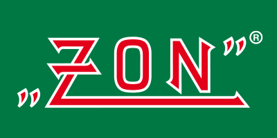

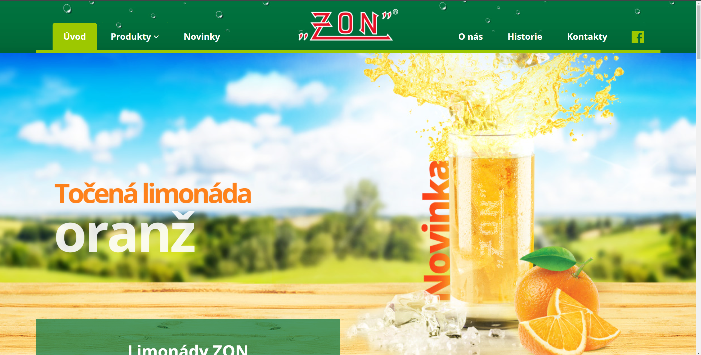

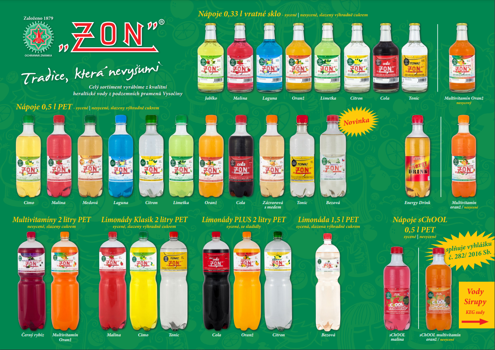

#### Inspiration:

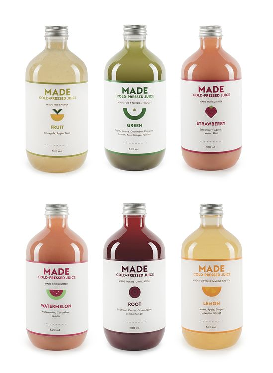

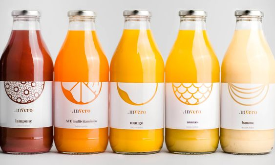

#### Keywords:

- fun
- summer
- fresh fruit
- friends
- family

#### Moodboard:
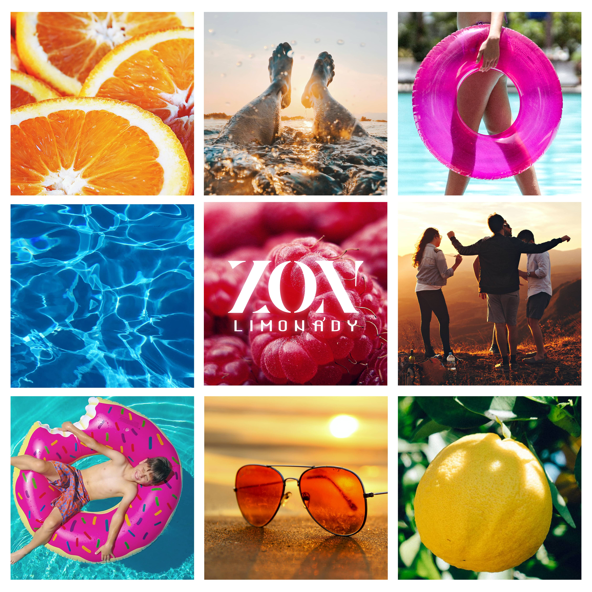

#### Package design on a mockup:

#### Shape of the bottle:

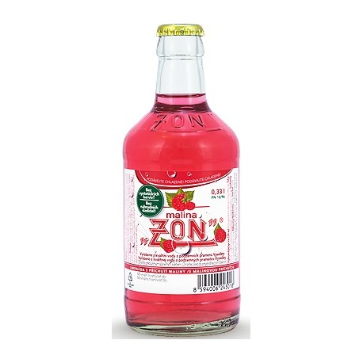

#### Label design:

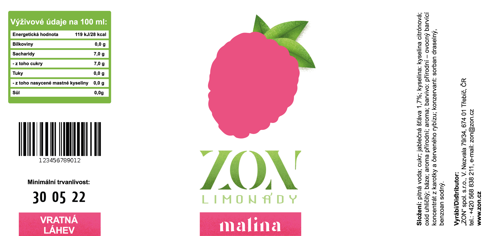

#### AI testing:

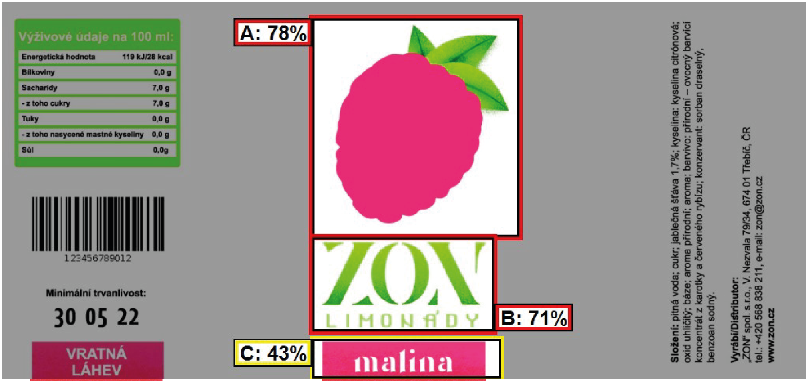

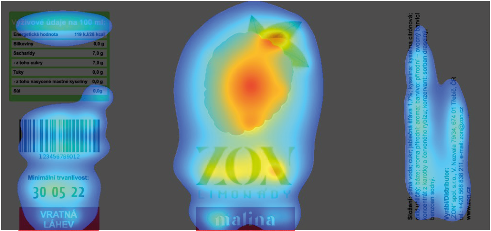

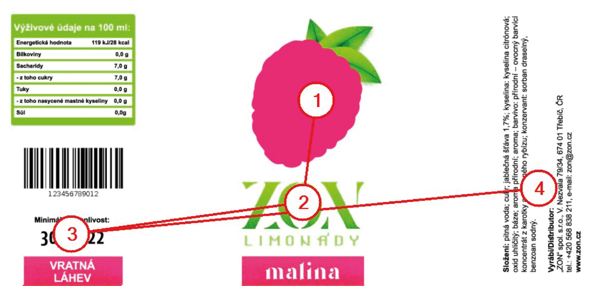
#### AI testing of the original label:

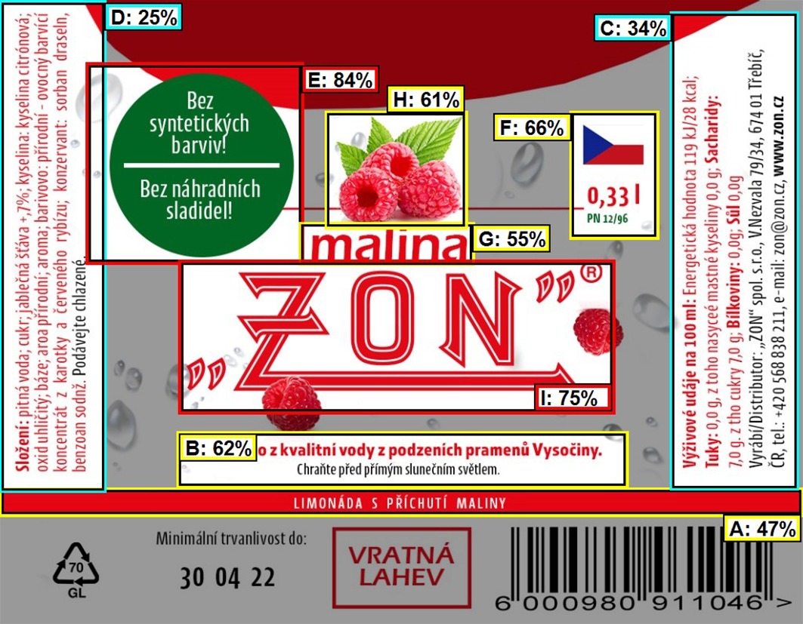

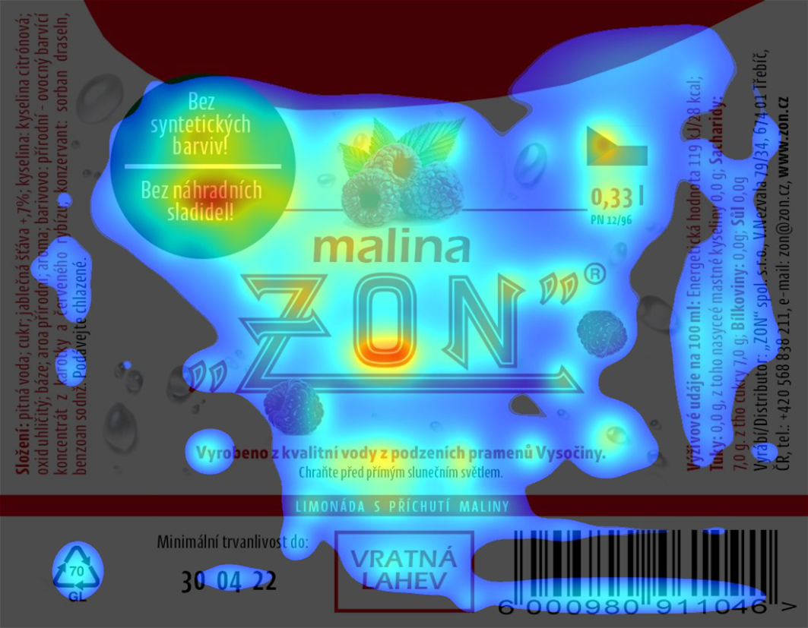
