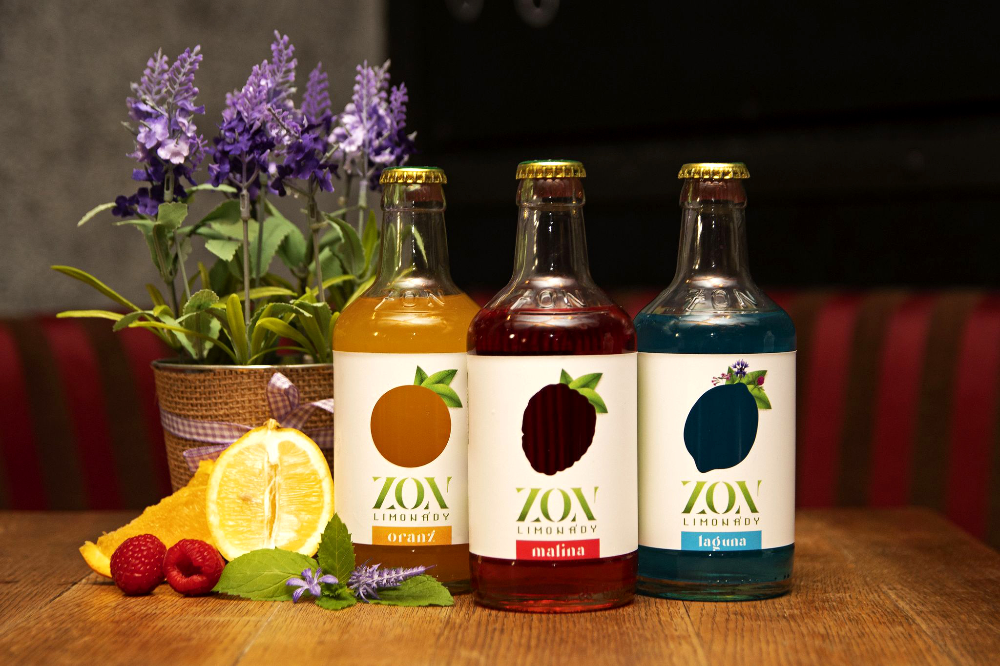
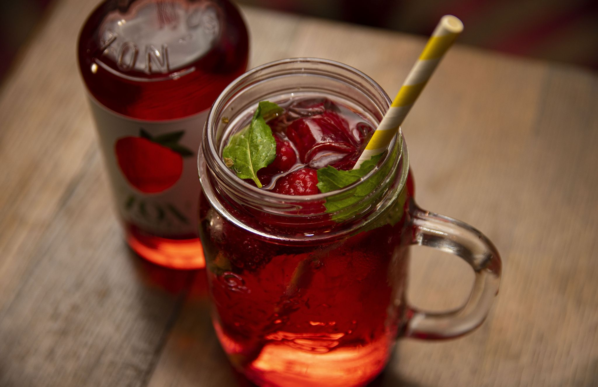

# Package design of ZON lemonades

Author Name(s): Markéta Rašínová

E-mail(s): market.rasinova@seznam.cz

Acknowledgement(s): I would like to thank Mr. doc. Joachim Rindler for his guidance in the process of writing this thesis. Furthermore to my family for the tremendous help and support throughout the whole process.

Data Accessibility/Availability Statement: There is no data archived.

Word count: <!-- Digests should be approximately 500 words. Everything below, including headings, image captions, etc., except references. -->

- - -

# Digest: Package design of ZON lemonades

## Abstract

This paper focuses on a new efficient package design of ZON lemonades. It aims to attract consumers' attention, correspond to ZON's brand values and increase the overall attractiveness of the product. According to a study from 2011, it was found that 44,6 % of interviewed people found the packaging to be outdated. When compared to data from 2022, the unhappiness with the brand's design grew to 73 %. Based on the information gained from both studies and a modern form of effectiveness testing, the focus of this thesis is to rebrand the ZON lemonades with an effective design strategy to highlight the brand's personality and make its products appealing. 

## Keywords

bottle design, package design, packaging, ZON lemonades

## Main Text
This thesis is separated into two sections - theoretical and practical. The first section is focused on the process of designing a package. It dives into the psychology of packaging, how the human brain works and what aspects of packaging design are the most important to highlight. Afterwards, it focuses on design strategy, shopability and effectiveness of the package, with insight into a brand identity and its target audience. The second section introduces ZON, its logo, visual identity and packages. Afterwards, it focuses on the findings of a survey and compares them to the findings of a similar survey from 2011. It takes the knowledge and designs packaging with a personalized design strategy. Afterwards, the packaging is tested with an AI tool and compared with the previous design.
<!--
Consider these four sections:

1. Introduction that puts the research in a broader context and provides added value through citations not included in the original article.
2. Summary of original article’s methods and results.
3. Further discussion on significance of findings.
4. Discussion connecting this work to other studies – provides added value through citations not included in original study.
    -->

## Images
### The package design:

<!-- Original figure(s) and caption(s) designed by digest author. And remeber to optimize images. -->
