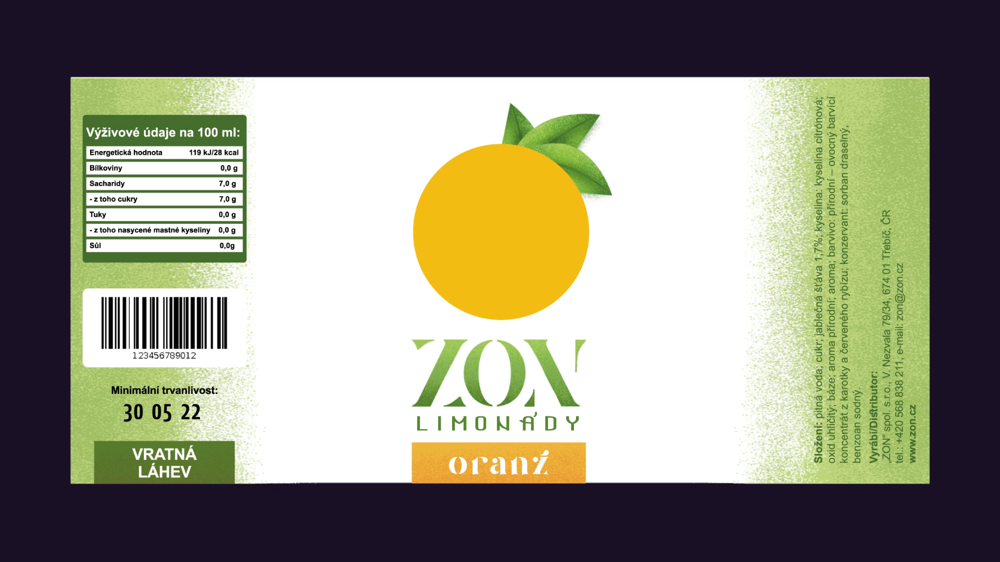
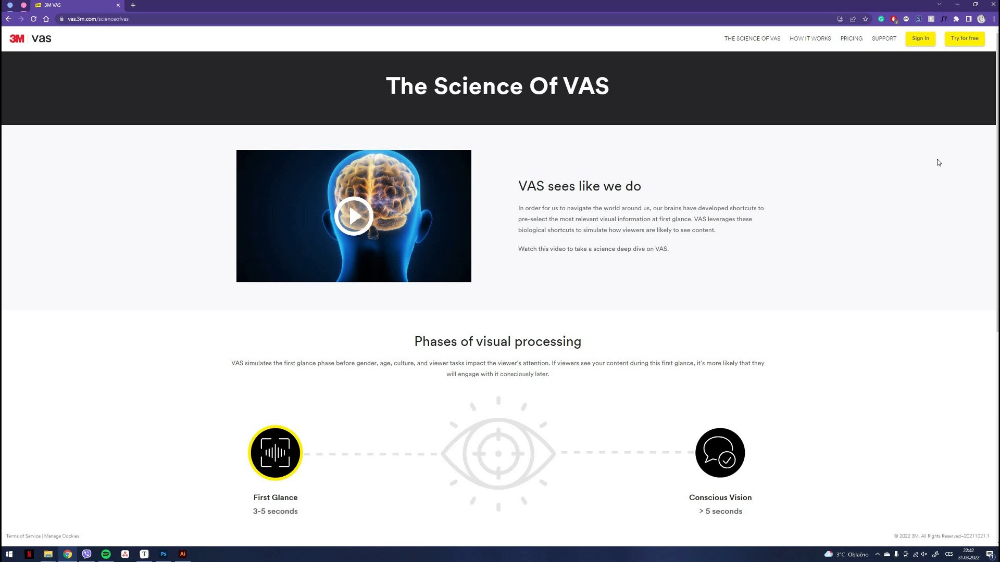
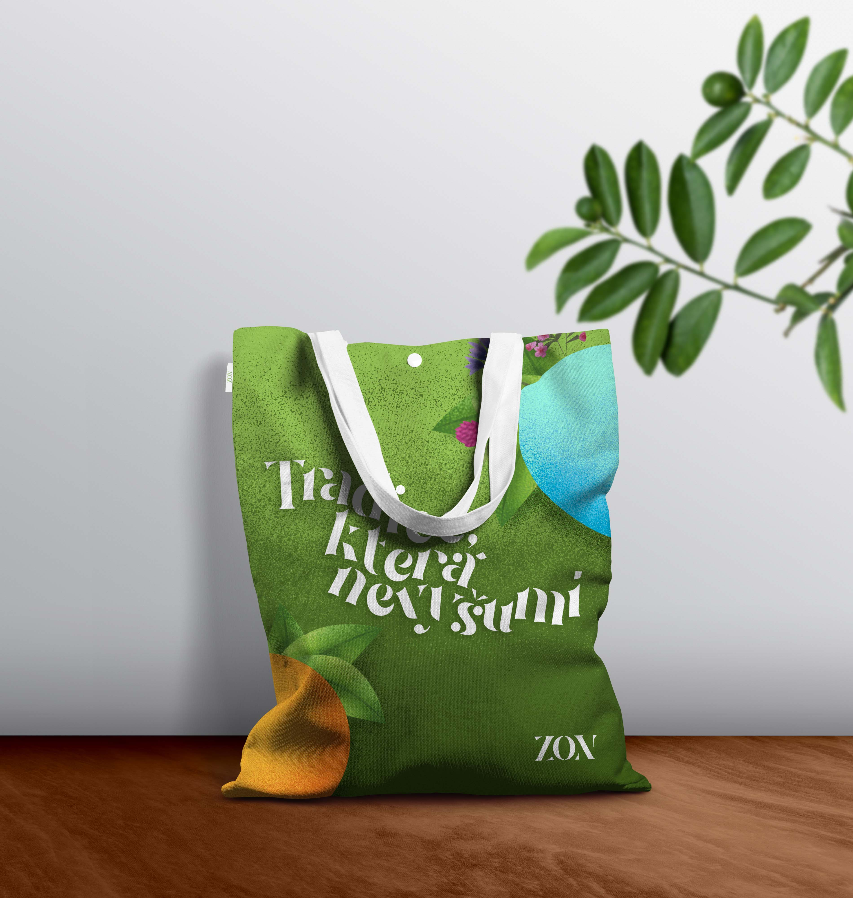

# BACHELOR THESIS

## Package design and visual identity of ZON lemonades

**[[Video presentation]](https://www.youtube.com/watch?v=5E-ANXzAYbw)**

### Brand analysis

**History of ZON**

Before we get to the fun stuff, let's get to know the brand and do a little analysis. ZON was created in 1879 by Ferdinand Kubeš and was passed on from generation to generation. There was a little pause when the business was nationalized, but 50 years or so later, they bought it back and now it's run by a great-grandson of the founder. 

**Target audience**

Who's their target audience? Students of any age. ZON lemonades are quite cheap, which makes them really popular with the young generation. ZON lemonades are sold at local swimming pools where kids spend the most time during the summer. They are a common good in any snack shop in schools or summer camp. They are quite popular in local pubs and restaurants all over the country.

### Current visual identity

**Logo**

 Ever since it was created, it was not changed or tweaked since. The typography is legible and easily recognizable. But since it is so old, it is outdated and lacks many benefits modern logos have. The sharpness of the edges and these dark colours make the brand seem unfriendly to potential customers. It lacks character and should communicate the personality of the brand. 

**Visual identity**

Let's address the colours first. Red is typically associated with fast-food chains. Mcdonald's, KFC, Coca Cola. It is therefore associated with unhealthiness, which is quite the opposite of what ZON stands for. It is an acronym for "Healthy refreshing beverages".

The choice of picking green as a secondary colour was smart. It is on the other end of the colour wheel, making it complement and highlight the red even further.  

The choice of dark yellow in this poster makes it really hard to read. They commonly use these shapes to attract our attention to a new product or a big sale. The bottles feel out of place and the whole look does not feel cohesive. It is overall very outdated.

**Package design**

Unlike the logo, the labels went through a redesign, which was highly needed. From a rounded square label with an image of the flavor, they switched to a white background with other elements in the colour of the lemonade itself. The label itself is really busy. There is a lot of information, which is not needed to be seen at a first glance. There is no clear hierarchy and our attention is all over the place.

### The research

In my thesis, I reference another work from 2011. It's themed around the branding of ZON. In their survey, they asked their respondents some questions about their knowledge of the brand and their opinion on their current visual identity, which I found incredibly useful. I published a similar survey with approximately the same amount of people, making it great for comparison. Let's have a look at some of the questions!

**"How would you rate the current logo of the brand?"**

In 2022, the results showcase a curve with the worst results as a peak.

In comparison, in 2011, people had more or less a neutral opinion on the logo but were mostly not impressed. Clearly, over time, the logo is less and less appealing.

**"How would you rate the current package design?"**

But a logo isn't a whole identity, right? There are so many elements that make a brand recognizable. And so, I added a few more questions myself. In the next question, I asked the respondents to rate the current package design. As you can see, there are more people happy with the current design, but the majority is still unhappy and would like a new label. 

**"How would you rate the image of the brand?"**

The next personalised question was focused on the whole image of the brand. The respondents were presented with the poster I showed you earlier and the results were much more consistent. The majority agreed that the current visual identity is outdated and lacking.

**"How would you rate the image of the brand?"**

Let's get back to comparing. In the next question, **I asked the respondents to pick an answer they felt they agreed the most with**. 73% of respondents said that the visual identity is outdated and that the innovation of the logo and the label of their lemonades would make the brand more appealing. The remaining 27% said the visual identity is modern, traditional and does not need any changes. 

When we compare this to the data from 2011, the results are quite different. Only 39,9% of respondents were unhappy with the visual identity and wanted change, while 60,1% viewed the visual identity as modern and traditional.

**When asked what would they change**, the results are pretty much identical. The majority of votes were cast for *logo design, brand colours and making the information on the label more spaced out*. Most people did not want to change the name of the brand or the shape of the glass bottle itself.

We've got the answers, let's hop into the fun part!

### Inspiration

There is nothing more fun than browsing through websites and books for inspiration. But what are we looking for? We want something classy, clean and simple. Ideally, I'd like to keep the white label. So at the end of my browsing session, I came up with these examples. What do they have in common? What parts of them would I like to keep? 

For example this one. Mainly white label and the main star of the whole package is the fruit itself. 

Same as this one. Clean, white-label, unified design on all flavours and an illustration of the fruit. 

Here's another classy look, but maybe a little too boring for a lemonade targeted at kids. 

This ice tea bottle looks amazing. Love how the bottom half of the package is seethrough, making it seem like there are actual leaves are floating in it.

### Moodboard

Moving on to the mood board! Before I started designing, I wanted to remake the logo and make a mood board with it to get a feel of the new direction I want to take. Through the survey, I found out that most people associate the brand with summer, swimming, summer camps and travelling with friends. What better time to have a lemonade? In my mood board, I wanted to highlight these fun activities and the freshness and healthiness of the lemonades. It makes you feel excited about summer, which is exactly what I wanted!

### Packaging

Moving on to the packaging design! We have the logo and an idea, so let's get to work. First of all, I wanted to increase the width of the label. The current one is just long enough to cover the front of the bottle, leaving the rest exposed. But by this, all of the unnecessary information is crammed in the front. By lengthening the sides a bit, we can leave the center blank for the most important elements. 

I wanted the fruit to be cut out, making the lemonade visible through the diagram. To make the fruit look more fresh and appetizing, I drew some leaves. 

Afterwards, we add the logo and make it quite big to make it stand out. 

And lastly, we want the flavour to be displayed in typography although it does not need to be as eye-catching. All of the work is done by the cutout. And there we have it! Let's move to the sides.

On one side, we'll have the ingredients and contact information. On the other, there's gonna be a box with nutritional information, then a barcode, the date of minimum durability and a piece of information, that these bottles are returnable. 

To make the packaging unified with the logo, I created a green gradient to further distinguish the sides from the front. And there we have it!

### AI Testing

Now let me show you something cool! To test the effectiveness of the design, I used an AI called 3M VAS. It is a visual attention software, which predicts what viewers will see at first glance. When potential buyers browse the store, it takes them only 3-5 seconds to decide, whether your product is interesting enough to stop by. Only then do they think about buying it. So these 5 seconds are the key to the success of the product.

The first thing we need to do is to highlight the areas of interest. From these elements, the software determines how likely it is that the potential buyer will notice an individual element. 

After we run the testing on my orange design, we find out that the most amount of attention is brought to the fruit, which is perfect! Close behind is the logo with 66% and lastly, our rectangle ended up with 29%, which is still great! In the case of this element, this number is ideal. It does not steal the attention from the fruit, which can communicate the flavour better, but it's still very likely the consumer will still notice it.

Other flavours had similar results. The least effective was the lagoon flavoured one, simply because the contrast between blue and green is not that big. However, the hierarchy remains and the fruit with the logo is still very extremely likely to be noticed.

During the second round of testing, the software no longer works with the areas of interest, but with the whole label. Keep in mind, that the sides will not be visible at first glance. The buyer has to stop first and turn the bottle around to notice it. But even then, the results are still displaying that the centre of attention is truly still on the fruit Take a look at these heat maps. As we saw in the previous round of testing, the most effective out of the three was raspberry, thanks to red and green being on the opposite side of the colour wheel. But overall, all of the labels passed the test with flying colours.

Just out of curiosity, let's compare the original label. I picked only some of the areas of interest, leaving the bottom of the label as it is. But even then, the results are pretty clearly showing, how the attention of the viewer is all over the place. Interesting!

### Bonuses

